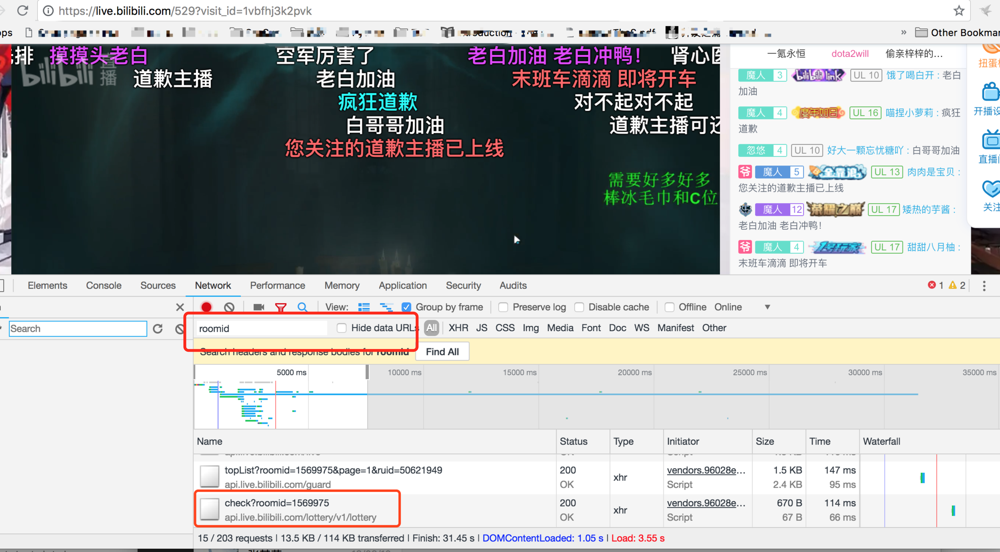

# b_danmu_ya

B站弹幕丫是抓取B站弹幕的Python脚本, 开源共大家学习交流使用
B站弹幕丫是由 https://github.com/piperck/b_danmu_chicken fork 而来, 可以说是站在巨人的肩膀上(在此感谢作者 piperck 造福人类的举动), 然后进行了增强改进, 目前V1.0版本能把所有的弹幕消息(弹幕消息,老爷欢迎,送礼物...)抓取到, 如此如果有需要可当成API供诸君使用.

增强/改进点：

1. 解决了TCP分包,粘包的问题,目前看来应该是完美解决了TCP包的问题,经过长时间的连续测试不会断线(>10 hours)
2. 双向心跳, 客户端向服务端发送心跳包问题, 以及服务端发往客户端心跳包解析
3. 增加了人气值(心跳包)的解析, 对没错就是播放器右上角部分的人气值显示, 看到弹幕输出❤️❤️❤️就是发送或者接收到心跳包
4. 关键部分加入了很多的调试日志, 初学者可以酌情打开调试追踪
5. ......

使用:
1. 获取B站直播房间的room_id

2. 将room_id 填入 dmj_v2.py 末尾处的room_id 变量
3. python2 dmj_v2.py 执行即可看到弹幕输出
